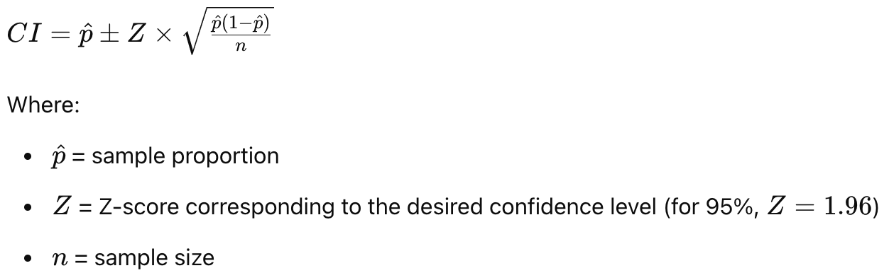

```{r setup, include=FALSE}
library(learnr)
library(dplyr)
library(ggplot2)
library(knitr)
knitr::opts_chunk$set(warning = FALSE,
                      echo = FALSE)

# FUNCTIONS
sampleFromPopulation <- function(sample_size, census){
  ss <- sample_size
  sample_data <- census %>% sample_n(ss, replace = F) # sample without replacement 
  
  return(sample_data)
}

compareSampleToPopulation <- function(sample, census){
  comparison <- bind_rows(
    census %>% mutate(group = "Population") %>% select(age, sex, malaria_infection, group),
    sample %>% mutate(group = "Sample") %>% select(age, sex, malaria_infection, group))
  
  return(comparison)
}

plotAgeSexDistribution <- function(comparison){
  comparison %>% 
  ggplot(aes(x = age, fill = sex)) +
    geom_histogram(binwidth = 5, color = "white", boundary = 0) +
    scale_fill_brewer(palette = "Set2") +
    labs(title = "Age and sex distribution", x = "Age (years)", y = "Count") +
    theme_minimal() +
    facet_wrap(~group, scales = "free_y")
}

plotInfectedProportion <- function(comparison){
  comparison %>% 
    count(group, malaria_infection) %>% 
    group_by(group) %>% 
    mutate(proportion = n/sum(n)) %>% 
    ungroup() %>% 
    ggplot(aes(x = group, y = proportion, fill = malaria_infection)) +
      geom_bar(stat = "identity") +
      geom_text(aes(label = scales::percent(proportion, accuracy = 0.1)), 
                color = "white",
                position = position_stack(vjust = 0.5),
                size = 4,
                show.legend = F) +
      scale_fill_brewer(palette = "Set1",
                        name = NULL) +
      scale_color_brewer(palette = "Set1") +
      scale_y_continuous(labels = scales::percent) +
      labs(title = "Malaria infection status", x = "", y = "") +
      theme_minimal()
}

checkPrevalenceCI <- function(true_prevalence, CI_lower, CI_upper){
  if(true_prevalence >= CI_lower & true_prevalence <= CI_upper){
    print(paste0("The true prevalence (", round(true_prevalence*100, 2),"%) falls within the 95%CI (", round(CI_lower*100, 2),"- ", round(CI_upper*100, 2), "%)"))
  }
  else {
    print(paste0("The true prevalence (", round(true_prevalence*100, 2),"%) does not fall within the 95%CI (", round(CI_lower*100, 2),"- ", round(CI_upper*100, 2), "%)"))
  }
}

simulate_CI <- function(census, sample_size, true_prevalence) {
  sample_data <- census %>% sample_n(sample_size, replace = F)
  infected_count <- sum(sample_data$malaria_infection == "Infected")
  p_hat <- infected_count / sample_size
  SE <- sqrt((p_hat * (1 - p_hat)) / sample_size)
  CI_lower <- p_hat - Z * SE
  CI_upper <- p_hat + Z * SE
  (true_prevalence >= CI_lower) & (true_prevalence <= CI_upper)
}

plotCISimulationResults <- function(results, n_simulations){
  results_df <- data.frame(result = results) %>% 
                mutate(result = case_when(result == FALSE ~ "Not within 95%CI",
                                          result == TRUE ~ "Within 95%CI"))
  
  results_df %>% 
  count(result) %>% 
  mutate(proportion = n/sum(n)) %>% 
  ggplot(aes(x = "", y = proportion, fill = result)) +
    geom_bar(stat = "identity",
             position = "fill",
             width = 0.5) +
    geom_text(aes(label = scales::percent(proportion, accuracy = 0.1),
                  color = result), 
            position = position_fill(vjust = 0.9), 
            size = 4,
            show.legend = F) +
    scale_fill_manual(values = c("Not within 95%CI" = "grey", "Within 95%CI" = "magenta4"),
                      name = NULL) +
    scale_color_manual(values = c("Not within 95%CI" = "grey30", "Within 95%CI" = "white"),
                      name = NULL) +
    scale_y_continuous(labels = scales::percent) +
    labs(title = paste0("Simulation results (N=", n_simulations, " simulations)"), x = "", y = "") +
    coord_flip() +
    theme_minimal() +
    theme(axis.ticks.y = element_blank(), axis.text.y = element_blank())
}

# PRE-LOADED DATA

# fake census data
# N <- 10000
# 
# set.seed(1234)
# 
# census <- data.frame(
#   id = 1:N,
#   age = sample(0:80, N, replace = TRUE), # not really realistic, eg 'young population' but maybe OK for these purposes?
#   sex = sample(c("Male", "Female"), N, replace = TRUE) #,
#   # malaria_infection = sample(c("Infected", "Not infected"), N, replace = TRUE, prob = c(0.3, 0.7)
# )
# 
# census <- census %>% 
#   # infection probability higher in children
#   mutate(infection_prob = case_when(age >=0 & age <= 14 ~ 0.60,
#                                     age > 14 & age <=44 ~ 0.30,
#                                     age > 44 ~ 0.10,
#                                     TRUE ~ 0.25),
#          malaria_infection = ifelse(runif(n()) <= infection_prob, "Infected", "Not infected")) %>% 
#   select(-infection_prob)
# 
# saveRDS(census, "data/census.rds")

census <- readRDS("data/census.rds")

# GLOBAL PARAMS FOR EXERCISES
true_infected_count <- sum(census$malaria_infection == "Infected")
true_prevalence <- true_infected_count / 10000

# get random sample
# set.seed(5) # to ensure we get the same random sample for our tutorial calculations

# set the sample size
# sample_size <- 200

# sample from the population
# sample_data <- sampleFromPopulation(sample_size, census) 
# saveRDS(sample_data, "tutorials/data/sample_data.rds")

# sample_data <- readRDS("tutorials/data/sample_data.rds")

# Number of infected individuals in the sample
# infected_count <- sum(sample_data$malaria_infection == "Infected")
# 
# p_hat <- infected_count / sample_size
# SE <- sqrt((p_hat * (1 - p_hat)) / sample_size)
Z <- 1.96
# CI_lower <- p_hat - Z * SE
# CI_upper <- p_hat + Z * SE
```

## Introduction

Welcome to Module 2: **Sampling from a population**.

In this module, we'll explore how to relate samples to populations, calculate confidence intervals, and understand the impact of sample size on study results. We are going to explore how to think about this when conducting studies to determine the prevalence of malaria to start with a simple example to gently introduce these statistical concepts. When we think about malaria molecular surveillance (MMS) studies, the same concepts apply. For example, in MMS studies we might be designing our study to determine the prevalence of *molecular markers* (for example, drug resistance markers) rather than malaria infection.

### Learning Outcomes

By the end of this tutorial, you will be able to:

-   Define the target population for a study.
-   Differentiate between a population and a sample.
-   Calculate the 95% confidence interval.
-   Assess how sampling variability impacts the representation of the population.
-   Understand the effect of sample size on confidence intervals.

## What is my population?

In any study, clearly defining the **target population** is crucial. Let's consider a few examples of made-up studies.

```{r quiz-study-pop}
quiz(caption = "QUIZ - Target population",
  question_checkbox("We want to estimate the prevalence of malaria infection in a community of 10,0000 people. Which of the following is the target population?",
           allow_retry = TRUE,
           answer("All residents", correct = TRUE),
           answer("Only women or only men", correct = FALSE, message = "If we want to estimate the prevalence in the *community* we don't want to focus only on women or men. <br>"),
           answer("Only children under 5 years old", correct = FALSE, message = "If we want to estimate the prevalence in the *community* we don't want to focus only on children. <br>"),
           answer("Adults over 60 years old", correct = FALSE, message = "If we want to estimate the prevalence in the *community* we don't want to focus on adults. <br>"), 
           correct = "That is correct! Our target population should be a sample of all the community residents, not a specific demographic or group.", 
           incorrect = "If we want to estimate the prevalence in the *community* we don't want to focus on a specific demographic or group. <br>"
  )
)
```

## Relating the sample to the population

It is often not feasible to sample the entire population, for example, due to costs or difficulty in sampling everyone. The good thing is we can design our study so that our target population is a **representative sample** of our population.

Often when designing epidemiological studies, different data sources can provide valuable information on our population, for example a Demographic and Health Survey (DHS) or a population census.

### Using the population census

Let's go back to our made-up study.

```{r}
# total population in census
N <- 10000

# infected population
infected_pop <- census %>% filter(malaria_infection == "Infected")
```

We now have access to a census of the entire population of the village (N= `r as.integer(N)`) with information on each residents age and sex. For purposes of this tutorial we "know" the true infection status of every individual, there are `r census %>% filter(malaria_infection == "Infected") %>% nrow()` people in the village with malaria infections. This will help us understand how our sample relates to the entire population.

This is the information we have in the census (here we show the first 6 residents in the census):

```{r}
kable(head(census))
```

Below we can see a breakdown of malaria-infected individuals in this population.

```{r}
census %>% 
  count(malaria_infection) %>% 
  mutate(proportion = n/sum(n)) %>% 
  ggplot(aes(x = malaria_infection, y = n, fill = malaria_infection)) +
    geom_bar(stat = "identity") +
    geom_text(aes(label = scales::percent(proportion, accuracy = 0.1),
                  color = malaria_infection), 
            nudge_y = 200,
            size = 4,
            show.legend = F) +
    scale_fill_brewer(palette = "Set1") +
    scale_color_brewer(palette = "Set1") +
    labs(title = "Malaria infection status", x = "", y = "Count") +
    guides(fill = F) +
    theme_minimal()
```

Let's look at the age and sex distribution.

```{r}
infected_pop %>% 
  ggplot(aes(x = age, fill = sex)) +
    geom_histogram(binwidth = 5, color = "white", boundary = 0) +
    scale_fill_brewer(palette = "Set2") +
    labs(title = "Malaria-infected population", x = "Age (years)", y = "Count") +
    theme_minimal()
```

### Sampling from the population

Suppose we have resources to sequence 200 samples. Let's randomly sample 200 individuals from the population and see how they 'compare'. 

Let's take a look at the demographics of our sample by plotting the age and sex distribution of the population and the sample. On the left we have the same age/sex distribution we saw above for the whole population, and on the right we see the distribution in our sampled individuals.

Below we use the function `sampleFromPopulation()` and we specify what our sample size is and from where we want to sample (in our case from the census data). 

*Do we see a similar age and sex distribution? What about the proportion of infected and not infected individuals in the population?*

We can use the `plotAgeSexDistribution()` and `plotInfectedProportion()` functions to visualize our results. Click on "Run Code". 

```{r sampling-1, exercise=TRUE}
sample <- sampleFromPopulation(sample_size = 200, census)
comparison <- compareSampleToPopulation(sample, census)

plotAgeSexDistribution(comparison)

plotInfectedProportion(comparison)
```

### Sampling many times from the population 

Now run this a few times with the sample size of 200 to see how it changes with every random sample. Click "Start Over" and then "Run code". 
```{r sampling-2, exercise=TRUE}
sample <- sampleFromPopulation(sample_size = 200, census)
comparison <- compareSampleToPopulation(sample, census)

plotAgeSexDistribution(comparison)
plotInfectedProportion(comparison)
```

```{r echo=F, eval=F}
# THIS IS A SANITY CHECK OF THE DISTRIBUTION - don't think we need this in the actual tutorial?

n_sim <- 1000
# Vector to store sample proportions
sample_proportions <- numeric(n_sim)

for (i in 1:n_sim) {
  sample_data <- census %>% sample_n(sample_size, replace = F)
  
  # Calculate sample proportion
  p_hat <- mean(sample_data$malaria_infection == "Infected")
  
  # Store the sample proportion
  sample_proportions[i] <- p_hat
}

# Calculate the mean and standard deviation of sample proportions
mean_p_hat <- mean(sample_proportions)
sd_p_hat <- sd(sample_proportions)

# Display the results
cat("Mean of sample proportions:", mean_p_hat, "\n")
cat("Standard deviation of sample proportions:", sd_p_hat, "\n")

# Plot histogram of sample proportions
hist(sample_proportions, breaks = 30, main = "Distribution of Sample Proportions", xlab = "Sample Proportion of Infected Individuals")
```


```{r quiz-sampling}
quiz(caption = "QUIZ - Sampling from the population",
  question_radio("Was the sample always the same?",
           answer("Yes", correct = FALSE),
           answer("No", correct = TRUE),
           correct = "That is correct! Sometimes our sample may not be representative of the population.",
           incorrect = "Are you sure? Try running the code above a few more times. Is it always reflective of the population in terms of age and sex distribution and/or with respect to the proportion of people infected?"
  )
)
```

```{r quiz-sampling-small}
quiz(caption = "QUIZ - Sampling from the population with small sample sizes",
  question_radio("Does our sample of 200 always reflect the population?",
           answer("Yes", correct = FALSE),
           answer("No", correct = TRUE),
           correct = "That is correct! When we have small sample sizes this can lead to high uncertainty and more variability thus our sample may not be representative of the population.",
           incorrect = "Are you sure? Try running the code above a few more times. You could even replace 200 with 50 to see how this impacts the results. Is it always reflective of the population in terms of age and sex distribution and/or with respect to the proportion of people infected? Smaller sample sizes are more susceptible to sampling variability. With a limited number of individuals, the likelihood of the sample deviating from the population characteristics increases."
  )
)
```


### ✨ BONUS QUESTION ✨

You will have noticed from our exploration above that the sample differs from the population and it doesn't always have the same age and sex distribution.

```{r quiz-sampling-bias}
quiz(caption = "QUIZ - Sampling bias",
  question_radio("Does this mean our sampling approach is biased?",
           answer("Yes", correct = FALSE),
           answer("No", correct = TRUE),
           correct = "That is correct! This does not necessarily mean our sampling approach is biased. Bias refers to a *systematic error* that consistently favors certain outcomes. However, because we are randomly sampling 200 individuals with *equal chance of being selected* our sampling approach is not biased. This can occur even if the characteristics of our sample (e.g., age and sex distribution) may not perfectly match those of the population.",
           incorrect = "That is not correct! Although our sample was not always reflective of the population (for example, the characteristics like age and sex distribution did not perfectly match), our *sampling* method was unbiased because we randomly sampled 200 individuals and each person had an equal chance of being selected. Bias refers to a *systematic error* that consistently favors certain outcomes, which was not the case here."
  )
)
```

## Estimating prevalence in our sample and calculating the 95% confidence interval

Our next topic focuses on calculating the 95% confidence interval (CI) using the Wald method. When we estimate the prevalence of malaria in our sample we obtain a *point* estimate. We also need to calculate its 95% CI to understand the variation around our estimate. The CI provides an interval with lower and upper bounds and in our case, it means that we are **95% confident that the true population prevalence lies within this interval**. If we were to repeat the sampling process many times and calculate a confidence interval each time, approximately 95 out of 100 of these intervals would contain the true population prevalence.

Below we will learn about the Wald CI formula and how we can calculate it in practice. 

### Estimating prevalence in our sample
For this exercise we have already pre-calculated some useful parameters:

- Defined `sample_size` to be 200
- Used the function `sampleFromPopulation()` to select 200 individuals at random from our census
- We counted the number of infected individuals in our sample and defined it as `infected_count` (in our example it is 69 individuals)

```{r sample-seed-params}
set.seed(5) # to ensure we get the same random sample for our tutorial calculations

# set the sample size
sample_size <- 200

# sample from the population
sample_data <- sampleFromPopulation(sample_size, census) 

# Count number of infected individuals in the sample
infected_count <- sum(sample_data$malaria_infection == "Infected")

# phat
p_hat <- infected_count/sample_size

# Z
Z <- 1.96

# SE
SE <- sqrt((p_hat * (1 - p_hat)) / sample_size)

# CI
CI_lower <- p_hat - Z * SE
CI_upper <- p_hat + Z * SE
```


Below is the code we ran for reference, but you don't have to run it yourself as everything is already loaded.
```{r global-params-code, echo=T, eval=F}
# set the sample size
sample_size <- 200

# sample from the population
sample_data <- sampleFromPopulation(sample_size, census) 

# Count number of infected individuals in the sample
infected_count <- sum(sample_data$malaria_infection == "Infected")
```

### What is the estimated prevalence of malaria in our sample?
We can calculate this by dividing the number of individuals infected with malaria by our sample size. 

Try coding it yourself or click on the hint. 

```{r est-prev, exercise = TRUE, exercise.setup = "sample-seed-params"}

```

```{r est-prev-solution}
69 / 200

# Or you can use the stored variables:
infected_count / sample_size
```

<details>

<summary style="text-decoration: underline; color: red;">

`r fontawesome::fa("check", fill = "red")`Click to see the answer

</summary>
Our estimated prevalence is 0.345 or 34.5%.

### Calculating the 95% CI

As we saw above, we need to also calculate the 95% CI around our estimate.

This is the **Wald confidence interval formula:**

{width="443"}

We are now going to go through this formula step-by-step!

#### 1. Defining our sample proportion, phat

The sample proportion refers to the proportion of infected individuals in our sample. We just calculated this above by dividing the number of infected individuals in the sample by the total sample size. Let's do it again for good measure, and record it as `p_hat`.

```{r phat, exercise=TRUE, exercise.setup = "sample-seed-params"}
p_hat <-
```

```{r phat-hint}
# Sample proportion
p_hat <- infected_count / sample_size
p_hat
```

##### 2. Sample size, n

Above we defined our sample size to be n=200 and recorded it as `sample_size`. 

##### 3. Calculating the standard error

Now we can calculate the standard error using `phat` and `sample_size` as shown below. 

```{r SE, exercise=TRUE, exercise.setup = "sample-seed-params"}
SE <- 
```

```{r SE-hint}
# Standard error
SE <- sqrt((p_hat * (1 - p_hat)) / sample_size)
SE
```

<details>

<summary style="text-decoration: underline; color: red;">

`r fontawesome::fa("check", fill = "red")`Click to see the answer

</summary>
Our standard error is 0.336 or 33.6%.

##### 4. Calculating the confidence interval

Now that we know our standard error, we can calculate the lower and upper bounds of our 95% CI. We use the Z-score for 95% confidence, which is `1.96` and record it as `Z`. Then we need to calculate our lower and upper bounds using the formula above. We need to multiply `Z` by our `SE` and substract it from `p_hat`. 

Let's start with the lower bound. Click on the hint if you need help. 
```{r ci-lower, exercise=TRUE, exercise.setup = "sample-seed-params"}
# Z-score for 95% confidence
Z <- 1.96

# Lower bound

```

```{r ci-lower-hint}
# Z-score for 95% confidence
Z <- 1.96

# Lower bound
p_hat - Z * SE
```

<details>

<summary style="text-decoration: underline; color: red;">

`r fontawesome::fa("check", fill = "red")`Click to see the answer

</summary> 
Our lower bound is 0.279 or 27.9%. 

</details>

Now let's calculate the upper bound. Remember now we need to *add* instead of substract. 
```{r ci-upper, exercise=TRUE, exercise.setup = "sample-seed-params"}
# Z-score for 95% confidence
Z <- 1.96

# Upper bound

```

```{r ci-upper-hint}
# Z-score for 95% confidence
Z <- 1.96

# Upper bound
p_hat + Z * SE
```

<details>

<summary style="text-decoration: underline; color: red;">

`r fontawesome::fa("check", fill = "red")`Click to see the answer

</summary>
Our upper bound is 0.411 or 41.1%. 
</details>

Let's put it all together! 
```{r ci-calculation, exercise=TRUE}
infected_count <- 69
sample_size <- 200
Z <- 1.96

p_hat <- infected_count / sample_size
SE <- sqrt((p_hat * (1 - p_hat)) / sample_size)
CI_lower <- p_hat - Z * SE
CI_upper <- p_hat + Z * SE

# Print our values
p_hat
CI_lower
CI_upper
```

So, putting it all together, our estimated prevalence is 0.345 or **34.5%** and our 95%CI is 27.91% to 41.11%.

## Comparing to the true prevalence estimate

You may remember from our exploration of the census data earlier, that 26.78% of our population was infected with malaria. 

```{r quiz-ci-prev}
quiz(caption = "QUIZ - Does our estimate fall within the 95%CI?",
     question("Is our true prevalence within the 95%CI?",
              answer("Yes", correct = F, message = "The true prevalence (26.78%) is not within the 95%CI of 27.9-41.1%"),
              answer("No", correct = T, "The true prevalence (26.78%) is not within the 95%CI of 27.9-41.1%. In the next exercise we are going to run some simulations to explore this further.")
     ))
```

## How often does true prevalence fall within the 95%CI?

We explored above what would happen if we randomly sampled 200 individuals. In this first example, the true prevalence didn't fall within the 95%CI. But this was just one example. Now we want to see what happens if we repeat this sampling *many* times. Let's now explore by running a simulation where we sample 1000 times and we will count how many times our true prevalence is within the 95%CI.

TODO "reflection"
Before you run the below code, think about the intuition behind this - how often do you expect the true prevalence to be within the 95%CI? Now run the code and see if you were correct! 

```{r sim-ci, exercise=TRUE}
n_simulations <- 1000
sample_size <- 200

results <- replicate(n_simulations, simulate_CI(census, sample_size, true_prevalence))

plotCISimulationResults(results, n_simulations)
```


# TODO 
QUIZ HERE and explanation of results! 

## Bonus

*Note: This section is optional and requires more coding than the previous exercise*

Let's repeat this exercise for a sample size of 500. Try coding it yourself from scratch using the functions that we used above. Click on the hint if you get stuck! 

Does our true prevalence fall within our 95% CI? What do you notice about the simulation results? 

```{r sampling-500, exercise=TRUE}
sample_size <- 500
```

```{r sampling-500-hint}
sample_size <- 500
sample_data <- sampleFromPopulation(sample_size, census)
comparison <- compareSampleToPopulation(sample_data, census)

plotAgeSexDistribution(comparison)
plotInfectedProportion(comparison)

infected_count <- sum(sample_data$malaria_infection == "Infected")

p_hat <- infected_count / sample_size
SE <- sqrt((p_hat * (1 - p_hat)) / sample_size)
CI_lower <- p_hat - Z * SE
CI_upper <- p_hat + Z * SE

checkPrevalenceCI(true_prevalence, CI_lower, CI_upper)

n_simulations <- 1000
results <- replicate(n_simulations, simulate_CI(census, sample_size, true_prevalence))
plotCISimulationResults(results, n_simulations)
```

## Resources
