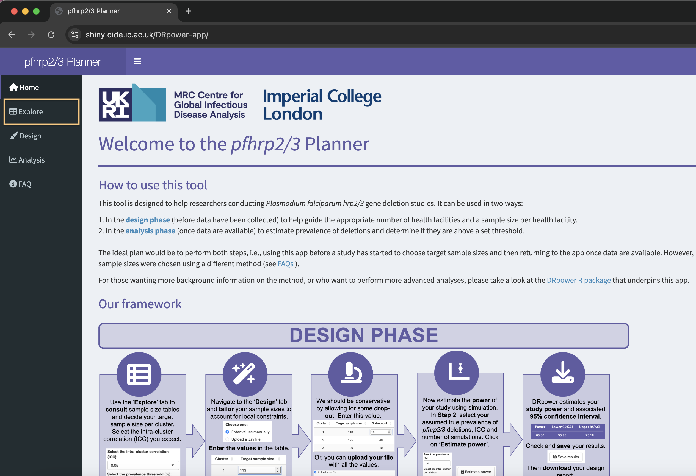
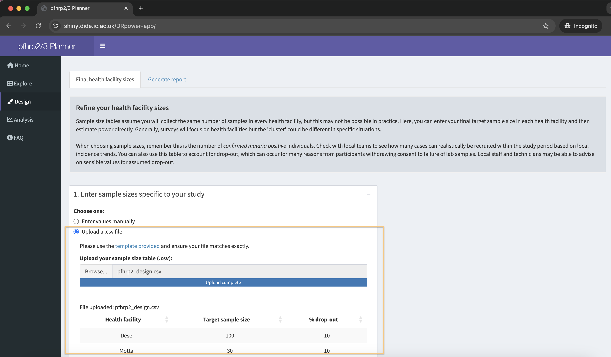
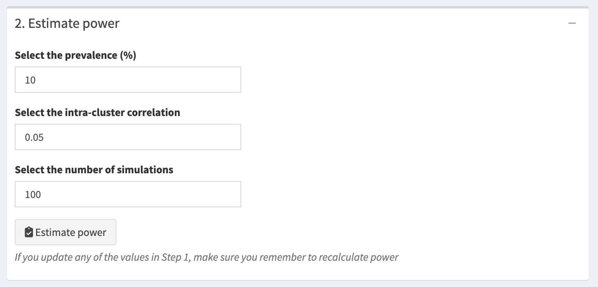

```{r setup, include=FALSE}
# options(repos = c(
#   plasmogenepi = "https://plasmogenepi.r-universe.dev",
#   CRAN = "https://cloud.r-project.org"
# ))

library(learnr)
library(dplyr)
library(ggplot2)
library(tidyr)
library(knitr)
library(kableExtra)
library(DRpower)

knitr::opts_chunk$set(warning = FALSE,
                      echo = FALSE)

# needed for longer calculations (eg DRpower) note - in seconds
tutorial_options(exercise.timelimit = 120)
```
## Introduction

Welcome to Activity 6: **The DRpower tool**.

In this module, we'll demonstrate the use of the **DRpower** tool. This is an R package that was primarily designed to help with the development of *P. falciparum* *pfhrp2/3* gene deletion studies. We we also explore the web-based *pfhrp2/3* Planner, which runs **DRpower** in the background but works via an intuitive user interface. This is the and is the recommended approach in the World Health Organisation [Master protocol for surveillance of pfhrp2/3 deletions and biobanking to support future research, second edition](https://www.who.int/publications/i/item/9789240099951). Either of these tools can be used to design *pfhrp2/3* deletion studies that are well powered, and to analyse the resulting data to arrive at robust conclusions.

### Learning outcomes

In this activity you will learn:

- How to design a multi-cluster *pfhrp2/3* deletion study.
- How to analyse and interpret the results of a *pfhrp2/3* deletion study.
- How to account for intra-cluster correlation in other study designs, such as prevalence surveys and presence/absence studies.

*Disclaimer: The scenarios in this document are entirely fictitious. While real place names are used, the data itself is artificial and designed for teaching purposes only. It does not necessarily represent the real epidemiological situation in these locations.*

## Designing a multi-cluster *pfhrp2/3* deletion study in Ethiopia

### Background

You have been tasked by the Ethiopian National Malaria Control Programme (NMCP) to assist with design and implementation of a study into *pfhrp2/3* deletions. Following the WHO recommendations in the [master protocol](https://www.who.int/publications/i/item/9789240099951), this study will be multi-site and conducted at a regional level. It will establish whether the prevalence of *pfhrp2/3* deletions among clinical malaria cases with false negative HRP2 RDT results is significantly above the 5% threshold. If so, this will trigger a nationwide switch in rapid diagnostic tests (RDTs) away from tests that rely exclusively on the HRP2 protein.

A full study of this sort would normally be run in parallel over multiple regions, however, for the purposes of this tutorial we will focus exclusively on the Amhara region.

### Using sample size tables

First, we need to scope out roughly how many sites and how many samples are required. The easiest way to do this is via pre-calculated sample size tables. Go to the *pfhrp2/3* Planner and navigate to the [Explore tab](https://shiny.dide.ic.ac.uk/DRpower-app/). 

{width="100%"}

You should see a sample size table with the number of sites (health facilities) in rows, and the assumed prevalence of *pfhrp2/3* deletions in columns (like below). The page automatically loads with the default ICC of **0.05** and the WHO **5%** prevalence threshold.

{width="100%"}

In any power analysis, we must begin by assuming a known effect size under the alternative hypothesis. For this study, that means selecting an assumed prevalence of *pfhrp2/3* deletions in the population. This assumption can be challenging and may feel somewhat arbitrary. It is important to remember that as the assumed prevalence decreases towards the 5% detection threshold, the required sample size increases significantly. Conversely, assuming a very high prevalence may reduce the public health relevance of the study by focusing power on detecting only large shifts in the parasite population — changes that could already be affecting clinical diagnosis.

To balance these factors, we recommend a default assumed prevalence of 10% (highlighted in purple). This value provides a reasonable sensitivity level while keeping sample sizes manageable and logistically feasible. For more insights on selecting this parameter, refer to the [FAQ section](https://shiny.dide.ic.ac.uk/DRpower-app/) in the web-based *pfhrp2/3* Planner.

```{r quiz-sizes-10}
quiz(caption = "QUIZ - Sample sizes",
  question("What is the *total* sample size needed (over all clusters) if we recruit 5 clusters?",
           allow_retry = TRUE,
           answer("2480", correct = TRUE),
           answer("678", correct = FALSE),
           answer("408", correct = FALSE),
           answer("300", correct = FALSE)
  ),
  question("What about if we recruit 10 clusters?",
           allow_retry = TRUE,
           answer("2480", correct = FALSE),
           answer("678", correct = FALSE),
           answer("408", correct = FALSE),
           answer("300", correct = TRUE)
           )
)
```

As the number of sites recruited increases, the total sample size actually decreases. This may seem counter-intuitive, as we might expect that adding more clusters would inherently make the study larger. What’s happening here is that with more clusters, the samples become *closer to independent*. By sampling from a greater number of distinct sites, we reduce the likelihood of repeatedly sampling from the same sub-population, thereby minimizing the impact of intra-cluster correlation. As a result, fewer samples are needed overall to achieve the same level of statistical power.

### Factoring in financial considerations

The Ethiopian NMCP has provided you with rough estimates of the costs of various aspects of the planned study, including the costs of RDT testing, microscopy, staff time, transport of samples and training. They estimate it will cost \$500 USD per health facility (cluster) recruited, plus an additional \$6 USD per sample enrolled.

```{r quiz-sizes-cost}
quiz(caption = "QUIZ - Sample sizes based on cost",
  question("Based on these financial figures, and using the numbers from the sample size table, how many clusters should you recruit to minimize the total cost?",
           allow_retry = TRUE,
           answer("2", correct = FALSE),
           answer("5", correct = FALSE),
           answer("7", correct = TRUE),
           answer("10", correct = FALSE),
           correct = "That is correct! The design with 7 clusters comes in at \\$6,365 UDS total. This is made up of \\$3,500 for setting up the clusters plus \\$2,856 for the samples enrolled. This is the cheapest of the possible options, although between 6 and 10 clusters are quite similar total costs and may also be viable options.",
           incorrect = "Hint: you may want to use R or Excel to calculate the total cost for each possible number of clusters."
  )
)
```


```{r, echo=FALSE, eval=FALSE}
ss <- DRpower::get_sample_size_table(prevalence = 0.1)
500*ss$n_clust + 6*ss$n_clust*ss$'0.1'
```


### Selecting sites

Next, we have to choose how to select the 7 sites. Common choices are 1) *sentinel site surveillance*, where known and established sites are chosen based on feasibility, and 2) *random selection*, where a complete list of all health facilities is compiled and a defined number of sites is drawn at random from this list.

Some advantages of sentinel site surveillance include:

- **Consistency and Comparability Over Time:** Sentinel sites are typically chosen for long-term monitoring, enabling consistent data collection over time. This allows for more precise trend analysis and easier comparisons of changes in disease prevalence.

- **Cost-Effectiveness and Established Infrastructure:** Sentinel sites are often strategically chosen for accessibility and logistical ease, making them more cost-effective than random site selection, which may require travel to remote or difficult-to-reach locations. Additionally, these sites usually have established infrastructure, trained personnel, and local relationships, streamlining data collection and improving data quality.

- **Targeting High-Burden or Priority Areas:** Sentinel sites are often selected based on epidemiological significance, such as higher disease burden or strategic relevance for outbreak monitoring. This targeted approach can be advantageous in understanding and responding to disease patterns in high-risk areas, which might be overlooked in a random selection approach. In addition, numbers of positive tests are easier to obtain. 

On the other hand, there are some advantages of random site selection:

- **Improved Representativeness and Reduced Selection Bias:** Random site selection from a complete list provides a more representative sample of the population and minimizes biases associated with known sentinel sites, which are often chosen based on specific criteria like accessibility or historical disease burden. This approach enhances the validity and generalizability of prevalence estimates, making them more applicable across various areas, including those not included in the survey.

- **Greater Diversity of Environmental Conditions:** Randomly selected sites are more likely to capture a range of environmental, socio-economic, and health system conditions. This variation is crucial for understanding factors that influence disease prevalence and for developing interventions that can apply across diverse settings.

```{r quiz-design}
quiz(caption = "QUIZ - Study design",
  question_radio("Which of these designs would you choose for this study?",
           allow_retry = TRUE,
           answer("Sentinel site surveillance ", correct = TRUE, message = "Actually, both are correct answers depending on your study."),
           answer("Random sampling", correct = TRUE, message = "Actually, both are correct answers, just as long as you can justify your choice.")
  )
)
```

In this tutorial we will go with random selection of sites. A complete list of all health facilities in the Amhara region is compiled, and 7 sites are selected from this list at random. **Table 1** gives the chosen sites and the target sample size based on our initial calculations.

```{r, echo=FALSE}
df1 <- data.frame(Site_name = c("Dese", "Motta", "Debark", "Metema", "Chagni", "Finote Selam", "Alem Ketema"),
           Sample_size = 68)

kable(df1, "html", col.names = c("Site name", "Sample size"), escape = FALSE,
      caption = "\nTable 1: target sample sizes based on initial exploration") |>
  kable_styling(bootstrap_options = c("striped", "hover"), full_width = FALSE) |>
  column_spec(1, width = "4cm") |>
  column_spec(2, width = "4cm")
```

### Refining sample sizes

With a preliminary study plan in place, we can now incorporate some real-world constraints. After discussions with site leads at each of the seven locations, we’ve learned that several sites may face challenges in reaching the target sample size. This could stem from factors like limited staffing, low malaria incidence, or other local issues. To address this, you’ve adjusted the sample sizes by increasing recruitment targets at sites where it is feasible to do so. Here’s the updated sample size table:

```{r, echo=FALSE}
df2 <- read.csv("data/pfhrp2_design.csv") |>
  select(-percent_dropout)

kable(df2, "html", col.names = c("Site name", "Sample size"), escape = FALSE,
      caption = "\nTable 2: target sample sizes factoring in constraints") |>
  kable_styling(bootstrap_options = c("striped", "hover"), full_width = FALSE) |>
  column_spec(1, width = "4cm") |>
  column_spec(2, width = "4cm") 
```

But now we are faced with a problem - how do we know if this new design has adequate power? We can no longer rely on sample size tables because these assume the same sample size per cluster. On the other hand, we cannot simply *assume* that power will be adequate. This is where the [Design tab](https://shiny.dide.ic.ac.uk/DRpower-app/) of the *pfhrp2/3* Planner becomes useful.

Download a .csv file with the current study plan [from here](https://drive.google.com/file/d/1MAx7geMGMOMCEaZ7dqSgQcsQ1H6-6X_l/view?usp=share_link). 

You can then upload this spreadsheet into the we app using the "Upload a .csv file" option. You should find that the table populates with these values.

{width="100%"}

You'll notice that drop-out is also considered at this stage. We are assuming 10% drop-out in each site, but for a more rigorous approach you may want to factor in different drop-out levels by site. When you click "Calculate adjusted sample sizes" you should see a table that contains the adjusted sample size, buffered for drop-out.

Now we are ready to estimate power. On the same page you will find drop-down menus where you can set the assumed prevalence of *pfhrp2/3* deletions and the intra-cluster correlation. When you hit the "Estimate power" button the tool will run a simulation-based power analysis (this may take a few seconds). 

{width="100%"}

Because this result is simulation-based we only get an *estimate* of the power, and not an exact figure. If you want a more precise estimate you can try increasing the number of simulations, although this will take longer to run.

```{r quiz-power}
quiz(caption = "QUIZ - Estimated power",
  question("Do you think power is adequate under the current plan?",
           allow_retry = TRUE,
           answer("Yes", correct = TRUE),
           answer("No", correct = FALSE)
  )
)
```

Running an estimate with 1000 simulations should show that the study’s power is close to 80%, with the 95% confidence interval likely spanning this target. For future reference, you can download a copy of your power analysis from the “Generate report” tab. Based on these results, the study plan appears statistically sound and ready for consideration. However, final approval should also take into account logistical and financial factors to ensure feasibility.

## Analyzing *pfhrp2/3* data

Some time later, the Ethiopian NMCP request your assistance once again to analyse the results of the *pfhrp2/3* deletion study, which was carried out according to your plan. The results of the study (number of *pfhrp2/3* deletions causing false negative HRP2 RDTs) are shown in **Table 3**.

```{r, echo=FALSE}
df3 <- read.csv("data/pfhrp2_results.csv")

kable(df3, "html", col.names = c("Site name", "pfhrp2 negative", "Sample size"), escape = FALSE,
      caption = "\nTable 3: Results of the pfhrp2/3 study") |>
  kable_styling(bootstrap_options = c("striped", "hover"), full_width = FALSE) |>
  column_spec(1, width = "3cm") |>
  column_spec(2, width = "3cm") |>
  column_spec(3, width = "3cm") 
```

You can download these results in .csv form [here](https://drive.google.com/file/d/1nWTYNZ6_955jFbXosRC3kL8pUFX9ehDu/view?usp=share_link). 

The easiest way to analyse these data is via the [Analysis tab](https://shiny.dide.ic.ac.uk/DRpower-app/) of the *pfhrp2/3* Planner. Select "Upload a .csv file" and import the data.

{width="100%"}

Now click the "Estimate prevalence" button to perform a Bayesian analysis of the data. This analysis takes into account the intra-cluster correlation in the data, which is estimated and accounted for in the prevalence estimate. Therefore, there is no need to estimate a design effect or effective sample size as these will be accounted for automatically.

You will also see a "Probability above threshold" field. This tells us the probability that the prevalence is above the 5% threshold. To turn this into a decision-making statistical framework, we need to decide on a level of confidence that we would be happy concluding that the prevalence is definitively over 5%. The power calculations in **DRpower** assume that we need 95% chance or higher to definitively conclude that prevalence is over 5%. This leads to two possible outcomes:

{width="100%"}


```{r quiz-prob}
quiz(caption = "QUIZ - Probability above threshold",
  question_radio("Looking at your analysis results in the app, which of these is true?",
           allow_retry = TRUE,
           answer("**Outcome 1:** There is less than 95% probability that the proportion of parasites with *pfhrp2/ 3* deletions causing false negative HRP2 RDT results within symptomatic *P. falciparum* patients is above the threshold. We conclude that this prevalence is below the threshold.", correct = FALSE),
           answer("**Outcome 2:** There is a 95% probability or higher that the proportion of parasites with *pfhrp2/ 3* deletions causing false negative HRP2 RDT results within symptomatic *P. falciparum* patients is above the threshold. We conclude that this prevalence is above the threshold.", correct = TRUE)
  )
)
```

In this example, we have sufficient evidence to conclude that the prevalence of *pfhrp2/3* deletions in the Amhara region is above the 5% threshold. Therefore, according to the WHO 2020 recommendation, we would be justified in a nationwide switch of RDTs to a brand that does not rely exclusively on the HRP2 protein.

### Estimating the ICC

As noted above, the **DRpower** method automatically accounts for ICC when estimating prevalence, so a separate ICC estimate is not strictly needed. However, obtaining an ICC estimate can still be valuable for future study planning. It’s a straightforward process and contributes to a broader understanding of ICC levels, which can benefit researchers planning similar studies in the future or in neighbouring regions.

Still on the [Analysis tab](https://shiny.dide.ic.ac.uk/DRpower-app/), scroll down to the "Estimate ICC" button (it should look like the screenshot below). Clicking this button gives an estimate of the ICC, including a point estimate and a 95% Credible Interval (CrI).

{width="100%"}

```{r quiz-icc}
quiz(caption = "QUIZ - Intra-cluster correlation",
  question("Based on the ICC analysis, which of these is true:",
           allow_retry = TRUE,
           answer("There is strong evidence that the ICC is below 0.2", correct = TRUE),
           answer("There is strong evidence that the ICC is below 0.1", correct = FALSE),
           answer("There is strong evidence that the ICC is below 0.05", correct = FALSE),
           answer("There is strong evidence that the ICC is zero (complete independence)", correct = FALSE)
  )
)
```

We can navigate to the "Generate report" tab to download a report detailing our analysis.

### Recap key points

Our *pfhrp2/3* analysis is now complete. We began with a well-powered study design, carefully crafted to be robust and realistic. We reinforced the reliability of our approach by accounting for varying sample sizes across sites and anticipating potential drop-out. Beyond statistical considerations, we incorporated logistical and financial constraints to ensure the study was feasible. Importantly, we accounted for possible overdispersion at both the design and analysis stages, increasing the robustness of the results. Ultimately, this rigorous approach allows us to conclude with confidence that the prevalence of *pfhrp2/3* deletions causing false-negative HRP2 RDTs exceeds the 5% threshold — a finding with significant implications for malaria control at the national level.

## Bonus questions

The **DRpower** R package is primarily designed with *pfhrp2/3* studies in mind, but also contains some functions that are useful for other multi-cluster designs. For example, it can be used when estimating prevalence to within a specified margin of error, or when detecting the presence of rare variants, while taking into account intra-cluster correlation. These features are only present in the R package, and are not present on the web-based *pfhrp2/3* Planner.

The following R code calculates the sample size needed for each cluster for a multi-cluster prevalence survey to reach a target margin of error. Try varying the value of the ICC and see how this impacts sample size.

```{r moe-calc, exercise = TRUE}
# calculate sample size needed to achieve a target MOE
DRpower::get_sample_size_margin(MOE = 0.1, n_clust = 10, prevalence = 0.2, ICC = 0.01)
```

The result you obtain is the sample size needed per cluster to achieve your target MOE using the Wald confidence interval (CI).

Until now, we have focused on using the Wald interval to construct a 95% CI. Although the Wald interval is straightforward to calculate, it relies on assumptions that may not always hold. For instance, with a small sample size or when prevalence is near 0 or 1, the Wald interval can extend beyond logical boundaries, producing prevalence values below 0 or above 1. Such results are nonsensical and indicate that the confidence interval may not accurately represent the underlying data.

An alternative approach is to use the Clopper-Pearson (CP) interval. Unlike the Wald interval, the CP interval always remains within the 0 to 1 range, making it more statistically robust. However, this robustness comes with a trade-off: the CP interval tends to be conservative, resulting in wider intervals.

Play around with the following R code, which still aims to reach a target margin of error but now assuming CP intervals. 

```{r moe-cp, exercise = TRUE}
# calculate sample size needed to achieve a target MOE using CP intervals
DRpower::get_sample_size_margin_CP(MOE = 0.1, n_clust = 10, prevalence = 0.2, ICC = 0.01)
```

The result you obtain is the sample size needed per cluster to achieve your target MOE using the CP interval.

<div style="padding: 10px; border-radius: 5px; background-color: #fef3e7;">
  <span style="font-size: 1.2em; color: #d19554;">
    <i class="fas fa-comment"></i> Reflection:
  </span> 

  <span style="color:#d19554;"> 
  What do you notice about the sample size compared to the simple Wald interval approach?
  </span>
</div>
<br>

Finally, we may want to look for the presence of rare variants in a multi-cluster design while accounting for intra-cluster correlation.

Play around with the following code. 

```{r cluster-sizes, exercise = TRUE}
# calculate sample size needed in a multi-cluster presence/absence study
DRpower::get_sample_size_presence(n_clust = 5, prevalence = 0.05, ICC = 0.05)
```

<div style="padding: 10px; border-radius: 5px; background-color: #fef3e7;">
  <span style="font-size: 1.2em; color: #d19554;">
    <i class="fas fa-comment"></i> Reflection:
  </span> 

  <span style="color:#d19554;"> 
  What total sample size would you need if you assume 10 clusters, 1% prevalence of the variant of interest, and an ICC of 0.05? How would this compare to the total sample size if you treated all sites as independent?
  </span>
</div>
<br>
The result you obtain is the sample size needed per cluster to detect the presence of rare variants at 1% prevalence.
